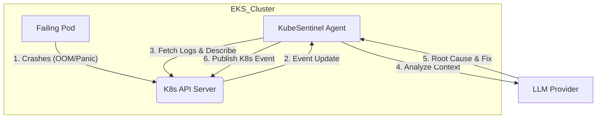

# KubeSentinel 🛡️

> **The AI-Powered SRE Agent for Kubernetes**

[](https://goreportcard.com/report/github.com/shishirshetty77/KubeSentinel)
[](https://opensource.org/licenses/MIT)

**KubeSentinel** is a custom Kubernetes Controller that transforms your cluster from "Self-Healing" to **"Self-Diagnosing"**.

It automatically detects pod failures (`CrashLoopBackOff`, `OOMKilled`), fetches the relevant logs, and uses **Large Language Models (LLMs)** to instantly analyze the root cause and suggest fixes.

---

## 🏗️ Architecture

KubeSentinel runs as a native Kubernetes deployment and interacts with the API Server to watch for state changes.



## 🚀 Key Features

- **Real-time Detection**: Instantly catches `CrashLoopBackOff`, `ImagePullBackOff`, and `OOMKilled`.
- **Smart Analysis**: Uses GenAI to parse stack traces and error codes (no more grepping regex).
- **Native Integration**: Reports findings directly as **Kubernetes Events** (`kubectl get events`).
- **Production Ready**: Built with **Terraform** (AWS EKS) and packaged with **Helm**.

## 🛠️ Tech Stack

- **Core**: Golang, Client-go, Controller Pattern
- **Infrastructure**: Terraform, AWS (EKS, VPC)
- **Packaging**: Docker (Distroless), Helm Charts
- **AI Integration**: Pluggable interface for OpenAI/Gemini

## 📦 Installation

### 1. Prerequisites

- Kubernetes 1.24+
- Helm 3.0+

### 2. Deploy with Helm

```bash
helm install kubesentinel ./deploy/charts/kubesentinel \
  --set serviceAccount.create=true
```

### 3. Verify

Trigger a crash in a test pod, then run:

```bash
kubectl get events --sort-by='.lastTimestamp'
```

_You will see a new event from `KubeSentinel` with the AI analylsis._

## 🛣️ Roadmap

- [ ] Integration with Slack / PagerDuty
- [ ] Auto-Remediation (Apply fixes automatically)
- [ ] FinOps Module (Detect wasted resources)

---

_Built with ❤️ by [Shishir Shetty](https://github.com/shishirshetty77)_
